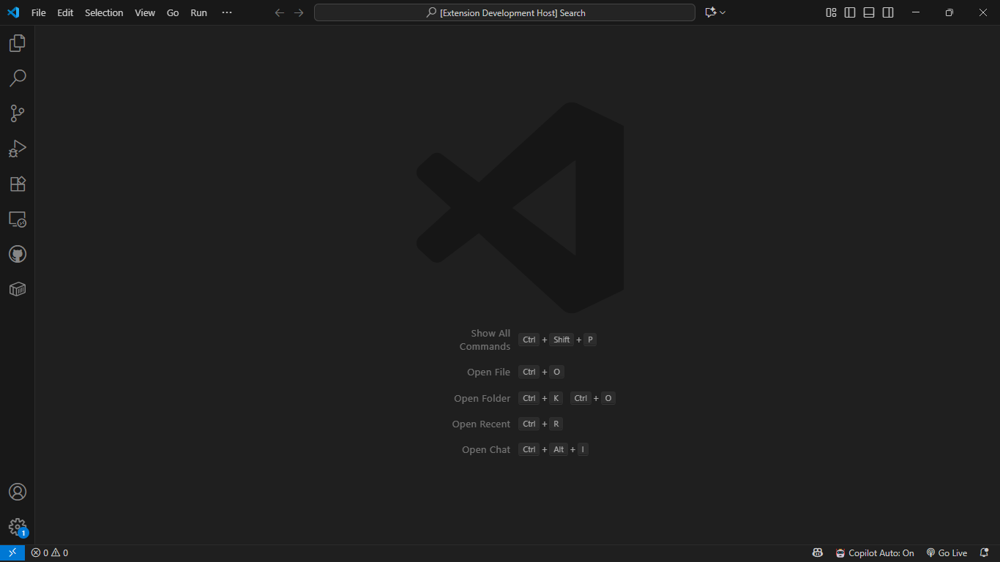
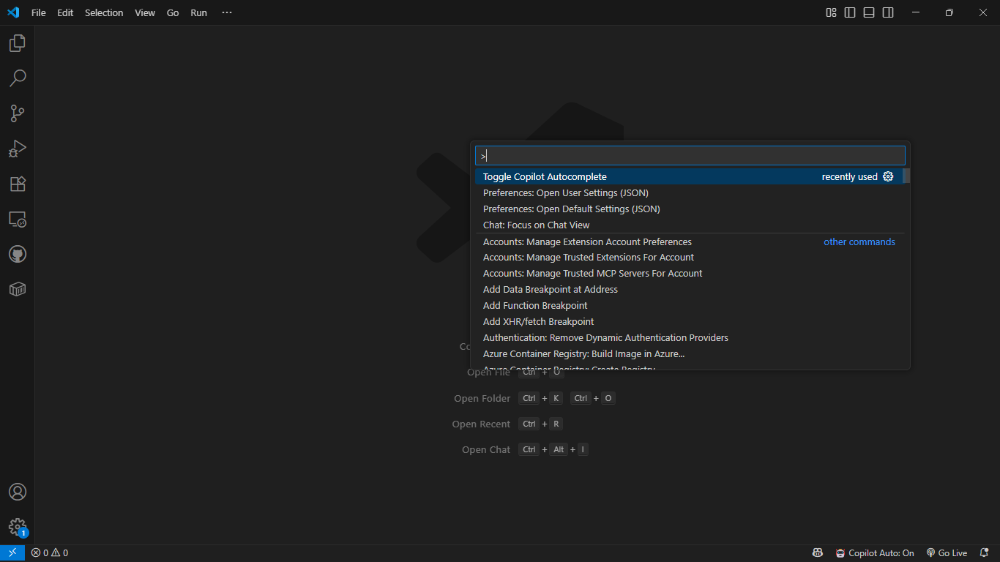

# copilot-toggle README

**copilot-toggle** is a simple VS Code extension that lets you quickly **enable or disable GitHub Copilot’s autocomplete feature** from the status bar or Command Palette — without turning off Copilot entirely.  

This is useful if you want Copilot for features like commit suggestions or chat, but don’t want inline code completions interfering while you type.

---

## Features

- Adds a **status bar button** to toggle Copilot autocomplete:
  - **Copilot: On** → Autocomplete enabled.
  - **Copilot: Off** → Autocomplete disabled.
- Adds a **command** in the Command Palette:  
  `Toggle Copilot Autocomplete`
- Keeps the toggle state visible in the status bar at all times.

### Screenshots

_Status bar toggle button:_  

_Command Palette:_  

---

## Requirements

- [GitHub Copilot extension](https://marketplace.visualstudio.com/items?itemName=GitHub.copilot) must be installed in VS Code.
- No additional configuration is required.

---

## Extension Settings

This extension does not add custom settings.  
Instead, it toggles the built-in Copilot autocomplete setting:  

- `github.copilot.editor.enableAutoCompletions` → **true/false**

---

## Known Issues

- The status bar may sometimes display stale state if settings are changed outside the toggle (for example, if you disable Copilot manually). Re-toggling will sync it back.  
- Requires the Copilot extension to be installed — otherwise, the command will have no effect.  

---

## Release Notes

### 1.0.0
- Initial release of `copilot-toggle`.
- Added status bar button and command palette integration.

---

## Following extension guidelines

This extension follows the official VS Code extension guidelines.  
For best practices and contributing, see:  
* [Extension Guidelines](https://code.visualstudio.com/api/references/extension-guidelines)

---

## Working with Markdown

If you want to tweak this README for your own fork, here are some quick tips:

* Split the editor (`Ctrl+\` on Windows/Linux, `Cmd+\` on macOS).
* Toggle preview (`Ctrl+Shift+V` on Windows/Linux, `Cmd+Shift+V` on macOS).
* Use `Ctrl+Space` to view Markdown snippets.

---

## For more information

- [Visual Studio Code's Markdown Support](http://code.visualstudio.com/docs/languages/markdown)  
- [Markdown Syntax Reference](https://help.github.com/articles/markdown-basics/)  

---

**Enjoy coding with Copilot — only when you want it**
